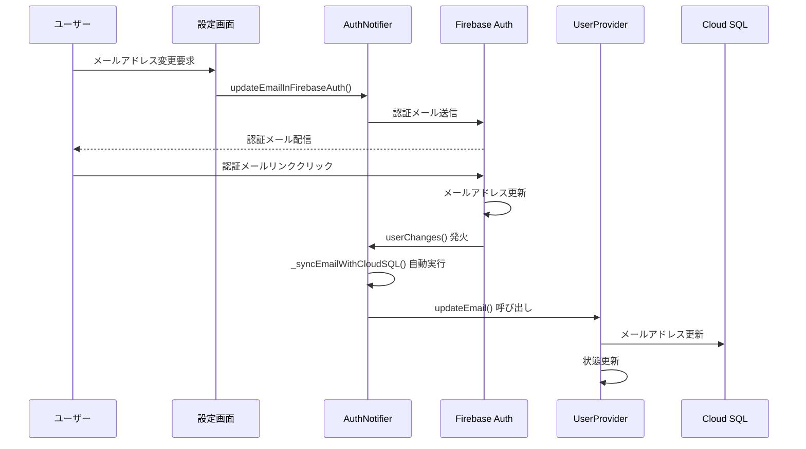

# メールアドレス自動同期機能実装ドキュメント

## 概要

Firebase Authの認証メール確認後、メールアドレス変更を自動検知してCloud SQLとuserProvider状態を同期する機能の実装詳細。

## 実装背景

### 解決する問題
- 2回目のメールアドレス変更時、Firebase Authは成功するがCloud SQLが更新されない
- ユーザーが認証メール確認後、手動でアプリ操作が必要
- Firebase AuthとCloud SQLの一貫性が保証されない

### 解決後の状態
- 認証メール確認と同時に自動でCloud SQLとuserProvider状態が同期
- ユーザーの追加操作不要
- Firebase AuthとCloud SQLの一貫性が保証

## アーキテクチャ設計

### クリーンアーキテクチャ準拠

```
Domain層 (AuthService拡張)
    ↓
Infrastructure層 (FirebaseAuthService実装)
    ↓
Presentation層 (AuthNotifier状態管理)
```

### MVVMパターン準拠
- **View**: 変更なし（既存のUI使用）
- **ViewModel**: AuthNotifierとUserNotifierが連携
- **Model**: Firebase Auth、Cloud SQL、userProvider状態

## 実装内容

### 1. AuthServiceインターフェースの拡張

**ファイル**: `lib/domain/services/auth_service.dart`

```dart
abstract class AuthService {
  // 既存メソッド...
  
  /// ユーザー情報（メールアドレス等）の変更を監視
  /// 
  /// Firebase Authの userChanges() ストリームをラップし、
  /// 認証メール確認後のメールアドレス変更などを検知する
  Stream<User?> userChanges();
}
```

### 2. FirebaseAuthServiceの実装

**ファイル**: `lib/infrastructure/services/firebase_auth_service.dart`

```dart
class FirebaseAuthService implements AuthService {
  final FirebaseAuth _firebaseAuth;
  
  @override
  Stream<User?> userChanges() => _firebaseAuth.userChanges();
}
```

### 3. AuthNotifierの機能拡張

**ファイル**: `lib/presentation/providers/auth_provider.dart`

#### userChangesリスナーの追加
```dart
class AuthNotifier extends StateNotifier<bool> {
  void _checkLoginStatus() {
    // 従来の認証状態監視
    _authService.authStateChanges().listen((User? user) {
      // 既存の処理...
    });
    
    // ユーザー情報（メールアドレス等）の変更を監視
    // Firebase Authのメールアドレスが変更された場合（認証メール確認後）に
    // Cloud SQLのメールアドレスを自動的に同期する
    _authService.userChanges().listen((user) async {
      if (user != null) {
        print('[AUTH_NEW DEBUG] ユーザー情報変更検知 - email: ${user.email}');
        await _syncEmailWithCloudSQL(user);
      }
    });
  }
}
```

#### 自動同期メソッドの実装
```dart
/// Firebase AuthとCloud SQLのメールアドレスを同期
///
/// [user] Firebase Authのユーザー情報
///
/// 処理内容:
/// 1. Firebase Authの最新メールアドレスを取得
/// 2. userProviderの現在のメールアドレスと比較
/// 3. 異なる場合はCloud SQLとuserProvider状態を更新
/// 
/// このメソッドはuserChangesリスナーから呼び出され、
/// 認証メール確認後のメールアドレス変更を自動検知して同期する
Future<void> _syncEmailWithCloudSQL(User user) async {
  try {
    // Firebase Authの最新メールアドレスを取得
    final firebaseEmail = user.email;
    if (firebaseEmail == null) return;
    
    // userProviderの現在のメールアドレスを取得
    final userState = ref.read(userProvider);
    final currentEmail = userState?.email;
    
    print('[AUTH_NEW DEBUG] Firebase Auth email: $firebaseEmail');
    print('[AUTH_NEW DEBUG] Current userProvider email: $currentEmail');
    
    // メールアドレスが異なる場合のみ同期
    if (firebaseEmail != currentEmail) {
      print('[AUTH_NEW DEBUG] メールアドレスが異なるため同期を実行');
      
      // Cloud SQLとuserProvider状態を更新
      await ref.read(userProvider.notifier).updateEmail(firebaseEmail);
      
      print('[AUTH_NEW DEBUG] メールアドレス自動同期完了: $firebaseEmail');
    } else {
      print('[AUTH_NEW DEBUG] メールアドレスは既に同期済み');
    }
  } catch (e) {
    print('[AUTH_NEW ERROR] メールアドレス自動同期エラー: $e');
    // エラーが発生してもアプリの動作は継続
  }
}
```

## 動作フロー

### 全体的な処理の流れ



### 詳細ステップ

1. **メールアドレス変更要求**
   - ユーザーが設定画面でメールアドレス変更を要求
   - Firebase Authが認証メールを送信

2. **認証メール確認**
   - ユーザーが認証メールのリンクをクリック
   - Firebase Authのメールアドレスが更新される

3. **自動検知・同期**
   - `userChanges()`リスナーがFirebase Authの変更を検知
   - `_syncEmailWithCloudSQL()`メソッドが自動実行
   - Firebase AuthとuserProviderのメールアドレスを比較
   - 異なる場合、`userProvider.updateEmail()`を呼び出し
   - Cloud SQL更新 + userProvider状態更新が実行される

## 技術的な特徴

### イベント駆動アーキテクチャ
- Firebase Authの`userChanges()`ストリームを活用
- 状態変化時の自動的な同期処理
- ユーザーの明示的な操作不要

### エラーハンドリング
```dart
try {
  // 同期処理
} catch (e) {
  print('[AUTH_NEW ERROR] メールアドレス自動同期エラー: $e');
  // エラーが発生してもアプリの動作は継続
}
```

### デバッグサポート
- 詳細なログ出力で動作状況を追跡可能
- Firebase Auth email vs userProvider email の比較ログ
- 同期実行の可視化

## 重要な注意点

### 1. リスナーの重複実行防止
- `userChanges()`は状態変化時のみトリガー
- 既に同期済みの場合はスキップ処理

### 2. エラー時の継続性
- 同期エラーが発生してもアプリの動作は継続
- ユーザー体験への影響を最小化

### 3. パフォーマンス考慮
- 必要時のみ同期処理を実行
- 不要なAPI呼び出しを避ける

## テスト方法

### 自動同期の確認手順
1. メールアドレス変更要求を実行
2. 認証メールのリンクをクリック
3. アプリのログで以下を確認：
   ```
   [AUTH_NEW DEBUG] ユーザー情報変更検知 - email: new@example.com
   [AUTH_NEW DEBUG] Firebase Auth email: new@example.com
   [AUTH_NEW DEBUG] Current userProvider email: old@example.com
   [AUTH_NEW DEBUG] メールアドレスが異なるため同期を実行
   [AUTH_NEW DEBUG] メールアドレス自動同期完了: new@example.com
   ```
4. userProviderの状態とCloud SQLが同期されることを確認

### 異常系テスト
- ネットワークエラー時の動作確認
- Firebase Auth更新失敗時の処理確認
- 同期処理中のアプリ終了での影響確認

## 今後の拡張可能性

### 他の情報の自動同期
- プロフィール画像URL
- ユーザー名
- その他のプロフィール情報

### 同期履歴の管理
- 同期処理の履歴記録
- 失敗時の再試行機能

---
*最終更新: 2025-09-17*
*実装完了度: 100%*