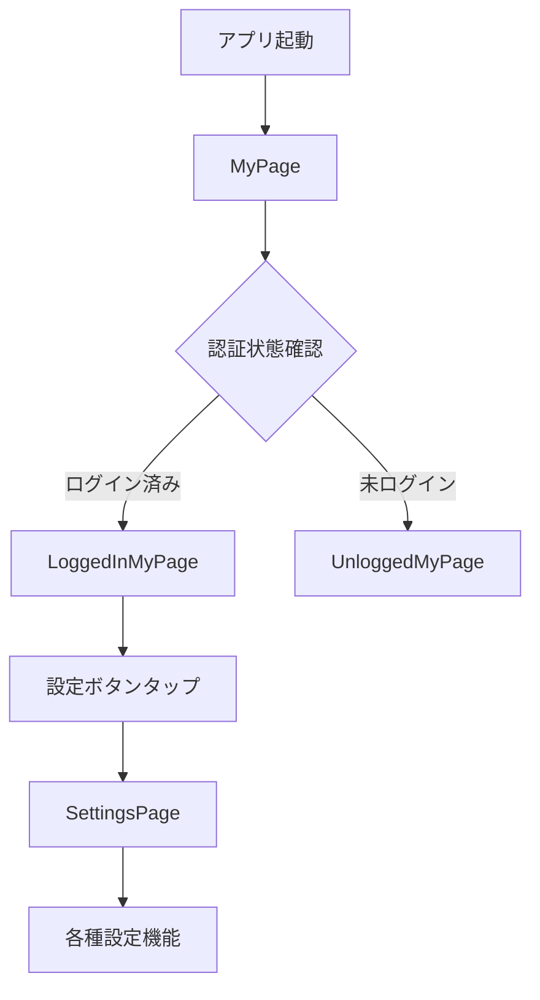

# 設定画面実装とファイル統合ドキュメント

## 概要

設定画面への遷移実装において発見された重複ファイル問題の解決と、統合による設定画面機能の完成。

## アーキテクチャ設計

### クリーンアーキテクチャ + MVVM準拠

```
Presentation層 (settings_page.dart)
    ↓
Domain層 (auth_usecases.dart, user_usecases.dart)
    ↓
Infrastructure層 (repositories)
    ↓
External (Firebase Auth, Cloud SQL API)
```

### 単一責任原則
- **SettingsPage**: 設定画面のUI表示とユーザー入力
- **MyPage**: 認証状態による画面切り替え
- **LoggedInMyPage**: ログイン済み用マイページ

## 問題の発見と解決

### 発見された問題
ログイン済みマイページから設定画面への遷移が機能しなかった原因：
- `logged_in_my_page.dart` と `logined_my_page.dart` の重複ファイル存在
- `my_page_gate.dart` と `my_page.dart` の機能重複  
- どちらのファイルが実際に使用されているか不明確

### 解決方針
1. **ファイル統合**: 機能的に重複しているファイルを1つに統合
2. **命名規則統一**: より適切な命名に統一
3. **インポート整理**: 統合後のファイルに合わせてインポート修正

## 実装変更

### 統合したファイル
- `logged_in_my_page.dart` を残し、`logined_my_page.dart` を削除
- `my_page.dart` を残し、`my_page_gate.dart` を削除

### 保持した理由
- `my_page_gate.dart` の機能は `my_page.dart` に統合可能
- `my_page.dart` は認証状態による画面切り替えを担当
- ログイン・未ログイン状態での適切な画面表示を維持

## 修正されたアーキテクチャ

### ルーティング構造
```dart
// app.dart のボトムナビゲーション
const MyPage(),  // 認証状態に応じて適切な画面を表示

// my_page.dart
class MyPage extends ConsumerWidget {
  @override
  Widget build(BuildContext context, WidgetRef ref) {
    final isAuthenticated = ref.watch(authProvider);
    
    if (isAuthenticated) {
      return const LoggedInMyPage();  // ログイン済み画面
    } else {
      return const UnloggedMyPage();  // 未ログイン画面
    }
  }
}
```

### 設定画面遷移の実装
```dart
// logged_in_my_page.dart
IconButton(
  icon: const Icon(Icons.settings, size: 32.0, color: Colors.grey),
  onPressed: () {
    Navigator.push(
      context,
      MaterialPageRoute(
        builder: (context) => const SettingsPage(),
      ),
    );
  },
),
```

## 設定画面の機能

### 現在実装済みの機能
1. **アカウント情報表示**
   - ユーザー名
   - メールアドレス
   - 登録日

2. **プロフィール設定**
   - プロフィール編集ページへの遷移
   - プロフィール画像変更

3. **アカウント管理**
   - メールアドレス変更機能
   - パスワード変更機能
   - アカウント削除機能

4. **アプリ設定**
   - 通知設定
   - 言語設定
   - テーマ設定

5. **情報・サポート**
   - アプリ情報表示
   - 利用規約
   - プライバシーポリシー
   - お問い合わせ

6. **認証関連**
   - ログアウト機能

## ファイル構造の整理

### 統合前の問題構造
```
lib/presentation/pages/
├── logged_in_my_page.dart     # 機能重複
├── logined_my_page.dart       # 削除対象
├── my_page.dart               # 認証状態管理
├── my_page_gate.dart          # 削除対象（機能重複）
└── settings_page.dart
```

### 統合後の構造
```
lib/presentation/pages/
├── logged_in_my_page.dart     # ログイン済みマイページ
├── my_page.dart               # 認証状態による画面切り替え
├── unlogged_my_page.dart      # 未ログインマイページ
└── settings_page.dart         # 設定画面
```

## 認証フローの改善

### 画面遷移パターン


### 状態管理
- **authProvider**: Firebase Authの認証状態を監視
- **userProvider**: ユーザー情報の状態管理
- **Riverpod**: 状態管理ライブラリとして使用

## 学習ポイント

### 1. 重複ファイルの危険性
同じ機能を持つファイルが複数存在すると、どちらが使用されているか不明確になり、保守性が大幅に低下する。

### 2. 統合の重要性
機能的に重複するファイルは統合し、単一責任の原則を守ることで、コードの可読性と保守性が向上する。

### 3. 段階的確認
ファイル削除前に依存関係を確認し、段階的に修正することで、安全なリファクタリングが可能。

### 4. 命名規則の統一
一貫した命名規則により、ファイルの役割と関係性が明確になる。

## テスト方法

### 正常系テスト
1. アプリ起動後、マイページタブを選択
2. ログイン状態での設定ボタン表示確認
3. 設定ボタンタップで設定画面遷移確認
4. 各設定項目の動作確認
5. 認証状態変更時の画面切り替え確認

### 統合確認テスト
1. 削除したファイルへの依存がないことを確認
2. インポート文の正確性確認
3. ビルドエラーがないことを確認

## 今後の拡張予定

### 機能追加
1. **ダークモード対応**: テーマ切り替え機能
2. **言語設定**: 多言語対応
3. **通知設定**: プッシュ通知の詳細設定
4. **データエクスポート**: ユーザーデータのバックアップ機能

### UI/UX改善
1. **設定カテゴリの整理**: より直感的な設定項目配置
2. **検索機能**: 設定項目の検索機能
3. **ヘルプ機能**: 各設定項目の説明機能

---
*最終更新: 2025-09-17*
*実装完了度: 100%*