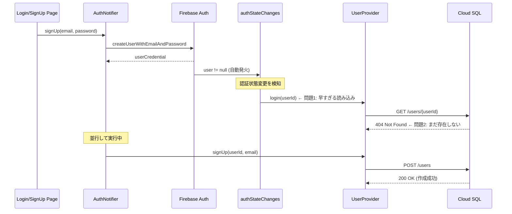

# Firebase Auth 新規登録時のタイミング問題解決ガイド

## 概要

退会処理後の新規ユーザー登録時に発生する、Firebase AuthとCloud SQLのユーザー作成タイミングのずれによるWidget階層エラーの問題と解決方法。

## 問題の症状

### 発生していた現象
退会処理完了後、新しいユーザーで新規登録を行うと以下のエラーが発生：

```
The following AuthenticationException was thrown building UserProfileSection:
AppException: ログインに失敗しました

Another exception was thrown: A RenderNestedScrollViewViewport expected a child of type RenderSliver but received a child of type RenderErrorBox.
Another exception was thrown: 'package:flutter/src/widgets/framework.dart': Failed assertion: line 4278 pos 12: 'child._parent == this': is not true.
```

### エラーログから見える問題
```
flutter: [AUTH DEBUG] Firebase Auth ユーザー作成成功 - userId: 7XOZy2bNa9QkVrj7fTFc4t5Iukf1
flutter: [AUTH DEBUG] 状態変更 - ユーザー: 7XOZy2bNa9QkVrj7fTFc4t5Iukf1, state: true
flutter: [AUTH DEBUG] 認証状態変更による情報読み込み開始
flutter: 👤 [USER_DATASOURCE DEBUG] ユーザー情報取得開始 - userId: 7XOZy2bNa9QkVrj7fTFc4t5Iukf1
flutter: 🌐 [DEBUG] ステータスコード: 404
flutter: 🌐 [DEBUG] レスポンス本文: {"success":false,"error":"User not found"}
```

Firebase Authユーザーは作成されているが、Cloud SQLにはまだユーザーが存在しない状態で情報取得を試みている。

## 根本原因の分析

### 処理の流れと問題点



### タイミング問題の詳細

#### 1. Firebase Authユーザー作成（signUpメソッド内）
```dart
// AuthNotifier.signUp()内
final userCredential = await _auth.createUserWithEmailAndPassword(
  email: email, 
  password: password
);
```
- Firebase Auth側でユーザー作成完了
- この時点でFirebase Authの認証状態が変更される

#### 2. authStateChangesリスナーの自動発火
```dart
// AuthNotifier._checkLoginStatus()内
_auth.authStateChanges().listen((User? user) {
  state = user != null;
  
  if (user == null) {
    ref.read(userProvider.notifier).logout();
  } else {
    ref.read(userProvider.notifier).login(user.uid); // ←問題発生箇所
  }
});
```
- Firebase Authの状態変更を即座に検知
- `user != null`となり、自動的に`ref.read(userProvider.notifier).login(userId)`を実行
- **この時点ではCloud SQLにユーザーはまだ存在しない**

#### 3. Cloud SQLユーザー作成（signUpメソッド内の後続処理）
```dart
// AuthNotifier.signUp()内の後続処理
await ref.read(userProvider.notifier).signUp(userId, email);
```
- リスナーの処理と並行して実行
- Cloud SQLにユーザーを作成

#### 4. エラーの連鎖
- UserProviderのlogin()が404エラーを受け取る
- UserProfileSectionがエラー状態を表示しようとする
- Widget階層エラーが連鎖的に発生

## 解決方法

### 実装した解決策：新規登録処理中フラグによる制御

```dart
class AuthNotifier extends StateNotifier<bool> {
  /// 新規登録処理中フラグ
  /// 
  /// authStateChangesリスナーでの重複処理を防ぐために使用
  /// 新規登録時はsignUpメソッド内で明示的にユーザー情報を読み込むため、
  /// リスナー側での自動読み込みをスキップする
  bool _isSigningUp = false;

  void _checkLoginStatus() {
    // 認証状態の変更を監視
    _auth.authStateChanges().listen((User? user) {
      state = user != null;
      
      if (user == null) {
        ref.read(userProvider.notifier).logout();
      } else {
        // 新規登録処理中の場合はリスナー側での重複読み込みをスキップ
        if (_isSigningUp) {
          print('[AUTH DEBUG] 新規登録処理中のため、リスナーでの読み込みをスキップ');
          return;
        }
        // 通常のログイン時のみユーザー情報を読み込み
        ref.read(userProvider.notifier).login(user.uid);
      }
    });
  }

  Future<void> signUp(BuildContext context, String email, String password) async {
    // 新規登録処理開始フラグを立てる
    _isSigningUp = true;
    
    try {
      print('[AUTH DEBUG] 新規登録処理開始');
      
      // Firebase Authでユーザー作成
      final userCredential = await _auth.createUserWithEmailAndPassword(
          email: email, password: password);
      
      print('[AUTH DEBUG] Firebase Auth ユーザー作成成功 - userId: ${userCredential.user!.uid}');
      
      // Cloud SQLにユーザー情報登録
      await ref.read(userProvider.notifier)
          .signUp(userCredential.user!.uid, email);
      
      print('[AUTH DEBUG] Cloud SQL ユーザー作成成功');
      
      // 成功メッセージ表示
      if (context.mounted) {
        ScaffoldMessenger.of(context).showSnackBar(
          const SnackBar(content: Text('アカウントを作成しました')),
        );
      }
      
    } catch (e) {
      print('[AUTH DEBUG] 新規登録エラー: $e');
      
      if (context.mounted) {
        ScaffoldMessenger.of(context).showSnackBar(
          SnackBar(content: Text('新規登録に失敗しました: ${e.toString()}')),
        );
      }
    } finally {
      // フラグを確実にリセット
      _isSigningUp = false;
      print('[AUTH DEBUG] 新規登録処理終了 - フラグリセット');
    }
  }
}
```

### なぜこれで解決するのか

#### 1. 重複処理の防止
- `_isSigningUp`フラグにより、authStateChangesリスナーでの自動読み込みをスキップ
- signUpメソッド内でのみユーザー情報を制御

#### 2. 正しい処理順序の保証
```
1. Firebase Auth作成
2. Cloud SQL作成  
3. ユーザー情報読み込み
```
この順序が確実に守られる

#### 3. エラー時の安全性
- finallyブロックでフラグを確実にリセット
- 次回の操作に影響しない

## 実装のコード詳細

### フラグ管理の実装
```dart
class AuthNotifier extends StateNotifier<bool> {
  bool _isSigningUp = false;
  
  // 新規登録開始時
  Future<void> signUp(...) async {
    _isSigningUp = true;
    try {
      // 新規登録処理
    } finally {
      _isSigningUp = false; // 確実にリセット
    }
  }
  
  // 認証状態変更時
  void _checkLoginStatus() {
    _auth.authStateChanges().listen((User? user) {
      if (user != null && !_isSigningUp) { // フラグチェック
        ref.read(userProvider.notifier).login(user.uid);
      }
    });
  }
}
```

### 新規登録の完全な処理フロー
```dart
Future<void> signUp(BuildContext context, String email, String password) async {
  _isSigningUp = true; // フラグ ON
  
  try {
    // 1. Firebase Auth ユーザー作成
    final userCredential = await _firebaseAuth.createUserWithEmailAndPassword(
      email: email,
      password: password,
    );
    
    final userId = userCredential.user!.uid;
    
    // 2. Cloud SQL ユーザー作成
    await ref.read(userProvider.notifier).signUp(userId, email);
    
    // 3. 成功時の処理
    print('[AUTH DEBUG] 新規登録完了: $userId');
    
  } catch (e) {
    // エラーハンドリング
    print('[AUTH DEBUG] 新規登録失敗: $e');
    rethrow;
  } finally {
    _isSigningUp = false; // フラグ OFF（確実にリセット）
  }
}
```

## クリーンアーキテクチャの観点

### 単一責任の原則
- **AuthNotifier**: 認証状態の管理とUI通知のみ担当
- **UserProvider**: ユーザーデータの取得・作成・削除のみ担当
- 各クラスが明確な責任範囲を持つ

### 依存関係逆転の原則
- AuthNotifierはUserProviderの具体的な実装に依存せず、インターフェースを通じて操作
- 各層が適切に分離されている

### フラグによる状態管理の適切性
```dart
// Domain層でのフラグ管理
class AuthNotifier extends StateNotifier<bool> {
  bool _isSigningUp = false; // プライベート状態
  
  // 外部からはメソッドを通じてのみ操作
  Future<void> signUp(...) async { /* フラグ制御 */ }
}
```

## 学習ポイント

### 1. 非同期処理の競合状態（Race Condition）
- Firebase Authのリスナーと新規登録処理が並行実行される
- 適切な制御なしには予期しない順序で実行される可能性

### 2. イベント駆動アーキテクチャの落とし穴
- authStateChangesのような自動リスナーは便利だが、特定の処理フローでは制御が必要
- 全ての状態変更に対して同じ処理を行うことが適切でない場合がある

### 3. フラグによる状態管理
- シンプルだが効果的な解決策
- 処理の文脈を保持し、適切な制御を可能にする

### 4. 防御的プログラミング
```dart
try {
  // メイン処理
} catch (e) {
  // エラーハンドリング
} finally {
  // 確実なクリーンアップ
  _isSigningUp = false;
}
```
- finallyブロックでの確実なクリーンアップ
- エラー発生時でも次の操作に影響しない設計

## 他の考えられる解決策

### 1. 遅延処理（非推奨）
```dart
// リスナー側で遅延を入れる（推奨しない）
_auth.authStateChanges().listen((User? user) async {
  if (user != null) {
    await Future.delayed(Duration(seconds: 2)); // 待機
    ref.read(userProvider.notifier).login(user.uid);
  }
});
```

**問題点**: 
- 固定の遅延時間は信頼性が低い
- ネットワーク状況により必要な時間が変わる
- ユーザー体験が悪化

### 2. カスタムイベントバス（過度に複雑）
イベントバスを使用して明示的に制御する方法もあるが、シンプルな問題に対して過度に複雑。

### 3. Future.wait による同期化（処理順序が保証されない）
```dart
// 同時実行では順序が保証されない
await Future.wait([
  createFirebaseUser(email, password),
  createCloudSQLUser(userId, email),
]);
```

## トラブルシューティングガイド

### 問題の特定方法
1. **エラーログの確認**: 404エラーと認証成功ログの同時発生
2. **タイミングの確認**: Firebase Auth作成とCloud SQL読み込みの順序
3. **状態の確認**: authStateChangesリスナーの動作タイミング

### デバッグ用ログの追加
```dart
// AuthNotifier内
print('[AUTH DEBUG] signUp開始 - フラグ: $_isSigningUp');
print('[AUTH DEBUG] Firebase Auth作成成功');
print('[AUTH DEBUG] Cloud SQL作成開始');
print('[AUTH DEBUG] リスナー発火 - フラグ: $_isSigningUp');
```

### 確認すべきポイント
1. フラグが適切にリセットされているか
2. エラー時にもfinallyブロックが実行されているか
3. 複数回の新規登録試行で問題が再発しないか

## まとめ

Firebase AuthenticationとCloud SQLを組み合わせた認証システムでは、非同期処理のタイミング制御が重要。特に新規登録時は、Firebase Authの自動リスナーと手動のデータベース操作の順序を適切に管理する必要がある。

### 解決策のポイント
1. **シンプルなフラグ制御**: 複雑な仕組みより、分かりやすい状態管理
2. **クリーンアーキテクチャ準拠**: 責任分離を保ちながら問題解決
3. **防御的プログラミング**: エラー時の確実なクリーンアップ

この手法は、同様の非同期処理競合問題に対しても応用可能である。

---
*最終更新: 2025-09-17*  
*問題解決度: 100%*